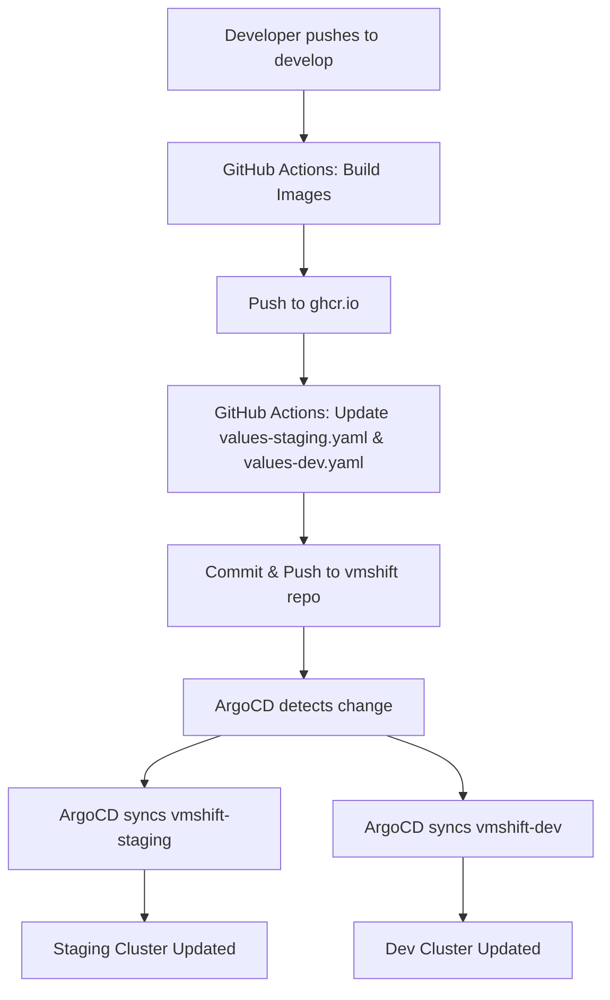
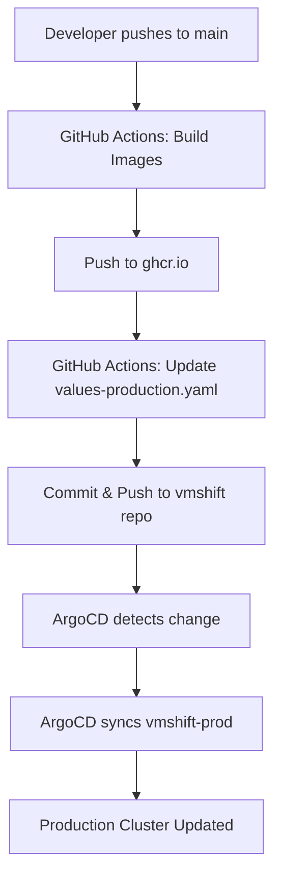

# Multi-Cluster GitOps with Single ArgoCD

## Overview
Single ArgoCD instance in **Production cluster** manages deployments to all three environments:
- **Production**: vmshift-prod (main branch) → Production cluster
- **Staging**: vmshift-staging (develop branch) → Staging cluster
- **Dev**: vmshift-dev (develop branch) → Dev cluster

## Architecture

```
┌─────────────────────────────────────────────────────────────────┐
│                     Production Cluster                          │
│                                                                 │
│  ┌──────────────────────────────────────────────────────────┐  │
│  │              ArgoCD (Single Instance)                    │  │
│  │                                                          │  │
│  │  ┌─────────────┐  ┌──────────────┐  ┌─────────────┐   │  │
│  │  │ vmshift-prod│  │vmshift-staging│  │ vmshift-dev │   │  │
│  │  │  (main)     │  │   (develop)   │  │  (develop)  │   │  │
│  │  └──────┬──────┘  └───────┬───────┘  └──────┬──────┘   │  │
│  └─────────┼─────────────────┼──────────────────┼──────────┘  │
│            │                 │                  │             │
│            ▼                 │                  │             │
│       vmshift-prod           │                  │             │
│        namespace             │                  │             │
└─────────────────────────────────────────────────────────────────┘
                               │                  │
                               ▼                  ▼
            ┌─────────────────────────┐  ┌────────────────────┐
            │   Staging Cluster        │  │    Dev Cluster     │
            │                         │  │                    │
            │   vmshift-staging       │  │   vmshift-dev      │
            │      namespace          │  │     namespace      │
            └─────────────────────────┘  └────────────────────┘
```

## Cluster Configuration

### Production Cluster (lke561964)
- **API Server**: https://172.234.2.39
- **ArgoCD UI**: http://172.234.2.39
- **Credentials**: admin / T3ECWVag1iT0mz7q
- **Manages**: All three environments

### Staging Cluster (lke562015)
- **API Server**: https://bb71cee1-2781-46d6-b409-8e633a601840.us-east-2-gw.linodelke.net:443
- **Registered in ArgoCD**: ✅ (staging-cluster-secret)
- **Managed by**: Production ArgoCD

### Dev Cluster (lke562023)
- **API Server**: https://9a0e3d87-c7ba-472c-88e6-949fac190c5d.us-east-1-gw.linodelke.net:443
- **Registered in ArgoCD**: ✅ (dev-cluster-secret)
- **Managed by**: Production ArgoCD

## ArgoCD Applications

All applications are defined in `terraform/argocd-apps/`:

### 1. vmshift-prod (Production)
```yaml
Source: https://github.com/ilearn-code/vmshift.git
Branch: main
Path: helm/vmshift
Values: values-production.yaml
Destination: Production cluster, vmshift-production namespace
```

### 2. vmshift-staging (Staging)
```yaml
Source: https://github.com/ilearn-code/vmshift.git
Branch: develop
Path: helm/vmshift
Values: values-staging.yaml
Destination: Staging cluster, vmshift-staging namespace
```

### 3. vmshift-dev (Development)
```yaml
Source: https://github.com/ilearn-code/vmshift.git
Branch: develop
Path: helm/vmshift
Values: values-dev.yaml
Destination: Dev cluster, vmshift-dev namespace
```

## GitOps Workflow

### Production Deployment (main branch)
```bash
1. Push to main branch
2. GitHub Actions: ci-cd.yaml builds images
   - vmshift-api:main-<commit-sha>
   - vmshift-celery:main-<commit-sha>
3. GitHub Actions: argocd-update.yaml updates values-production.yaml
4. ArgoCD detects change and syncs vmshift-prod application
5. Production cluster updated automatically
```

### Staging/Dev Deployment (develop branch)
```bash
1. Push to develop branch
2. GitHub Actions: ci-cd.yaml builds images
   - vmshift-api:develop-<commit-sha>
   - vmshift-celery:develop-<commit-sha>
3. GitHub Actions: argocd-update.yaml updates values-staging.yaml and values-dev.yaml
4. ArgoCD detects changes and syncs both applications:
   - vmshift-staging → Staging cluster
   - vmshift-dev → Dev cluster
5. Both clusters updated automatically
```

## Access ArgoCD

### ArgoCD UI
```bash
URL: http://172.234.2.39
Username: admin
Password: T3ECWVag1iT0mz7q
```

### View Applications
```bash
# From production cluster
export KUBECONFIG=terraform/kubeconfig-production.yaml
kubectl get applications -n argocd

# Expected output:
# NAME              SYNC STATUS   HEALTH STATUS
# vmshift-dev       Synced        Healthy
# vmshift-prod      Synced        Healthy
# vmshift-staging   Synced        Healthy
```

### View Cluster Secrets
```bash
export KUBECONFIG=terraform/kubeconfig-production.yaml
kubectl get secrets -n argocd | grep cluster

# Expected output:
# dev-cluster-secret
# staging-cluster-secret
```

## Application URLs

### Production
- **Application**: http://vmshift.satyamay.tech
- **Health Check**: http://vmshift.satyamay.tech/health
- **Domain**: vmshift.satyamay.tech → 172.234.3.83

### Staging
```bash
# Get staging LoadBalancer IP
export KUBECONFIG=terraform/kubeconfig-staging.yaml
kubectl get svc -n vmshift-staging vmshift-nginx-ingress-controller

# Configure DNS: vmshift-staging.satyamay.tech → <staging-ip>
```

### Dev
```bash
# Get dev LoadBalancer IP
export KUBECONFIG=terraform/kubeconfig-dev.yaml
kubectl get svc -n vmshift-dev vmshift-nginx-ingress-controller

# Configure DNS: vmshift-dev.satyamay.tech → <dev-ip>
```

## File Structure

```
terraform/
├── argocd-apps/
│   ├── staging-app.yaml        # ArgoCD application for staging
│   └── dev-app.yaml            # ArgoCD application for dev
├── cluster-secrets/
│   ├── staging-cluster.yaml    # Staging cluster credentials
│   └── dev-cluster.yaml        # Dev cluster credentials
└── argocd.tf                   # Production ArgoCD + vmshift-prod app

.github/workflows/
├── ci-cd.yaml                  # Build images on push
└── argocd-update.yaml         # Update Helm values after build
```

## Manual Sync

If you need to manually trigger a sync:

```bash
# Login to ArgoCD CLI
export KUBECONFIG=terraform/kubeconfig-production.yaml
argocd login 172.234.2.39 --username admin --password T3ECWVag1iT0mz7q --insecure

# Sync specific application
argocd app sync vmshift-prod      # Production
argocd app sync vmshift-staging   # Staging
argocd app sync vmshift-dev       # Dev

# Sync all
argocd app sync --all
```

## Verify Deployments

### Check Application Status in ArgoCD
```bash
export KUBECONFIG=terraform/kubeconfig-production.yaml
kubectl get applications -n argocd -o wide
```

### Check Pods in Each Cluster

**Production:**
```bash
export KUBECONFIG=terraform/kubeconfig-production.yaml
kubectl get pods -n vmshift-production
```

**Staging:**
```bash
export KUBECONFIG=terraform/kubeconfig-staging.yaml
kubectl get pods -n vmshift-staging
```

**Dev:**
```bash
export KUBECONFIG=terraform/kubeconfig-dev.yaml
kubectl get pods -n vmshift-dev
```

## Troubleshooting

### Application Not Syncing

1. Check application status:
```bash
export KUBECONFIG=terraform/kubeconfig-production.yaml
kubectl describe application vmshift-staging -n argocd
```

2. Check ArgoCD logs:
```bash
kubectl logs -n argocd -l app.kubernetes.io/name=argocd-application-controller
```

### Cluster Connection Issues

1. Verify cluster secret:
```bash
kubectl get secret staging-cluster-secret -n argocd -o yaml
```

2. Test cluster connectivity from ArgoCD:
```bash
kubectl exec -it -n argocd <argocd-application-controller-pod> -- \
  argocd cluster list
```

### Values File Not Found

Ensure your vmshift repo has all required values files:
- `helm/vmshift/values-production.yaml`
- `helm/vmshift/values-staging.yaml`
- `helm/vmshift/values-dev.yaml`

## Benefits of Single ArgoCD

✅ **Centralized Management**: One UI to monitor all environments  
✅ **Consistent Configuration**: Same ArgoCD version across environments  
✅ **Cost Efficient**: Reduced resource usage (1 ArgoCD vs 3)  
✅ **Simplified Operations**: Single upgrade path, single backup  
✅ **Cross-Environment View**: Easy comparison between environments  

## Security Considerations

- Cluster credentials stored as Kubernetes secrets in production
- Bearer tokens have full cluster access (use RBAC to limit)
- Consider separate ArgoCD projects per environment
- Enable RBAC in ArgoCD for multi-user access
- Use cert-manager for HTTPS (currently pending)

## Next Steps

1. ✅ Production ArgoCD installed
2. ✅ Staging cluster registered
3. ✅ Dev cluster registered
4. ✅ All three applications created
5. ⏳ Wait for applications to sync
6. ⏳ Configure staging/dev DNS (vmshift-staging.satyamay.tech, vmshift-dev.satyamay.tech)
7. ⏳ Test full deployment flow (push to develop branch)
8. ⏳ Enable HTTPS with cert-manager
9. ⏳ Configure ArgoCD RBAC for team access

## Complete Flow Example



For production:

